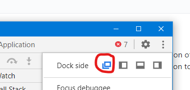

# minified-GLS
A complete solution of minified guided learning solution on top of google.com

## Steps : 
1. Copy the script from player.js file.
2. Go to Google.com
3. Open the Inspect Element (Ctrl+Shift+I)
4. Dock it to "Unlock into separate window". { **Important**, click on the option highlighted in the image below }
5. Open the Sources panel -> Click on the New Snippet -> Give any name to it and paste the copied script into the editor.
6. Do a Run (Ctrl + Enter)
Your Guide has now started. Click on Next to go to the next guide.

Once the guide has ended, to run the guide again, please do the 5th and 6th steps again.

## Note : 
1. Please make sure that you have opened the panel as a separate window (see above Step 4, and below image)
2. For the guide step 2 (the one showing Images step), the guide will be shown in the bottom of the element instead of right as mentioned in the jsonp steps, because of space constraint. 

